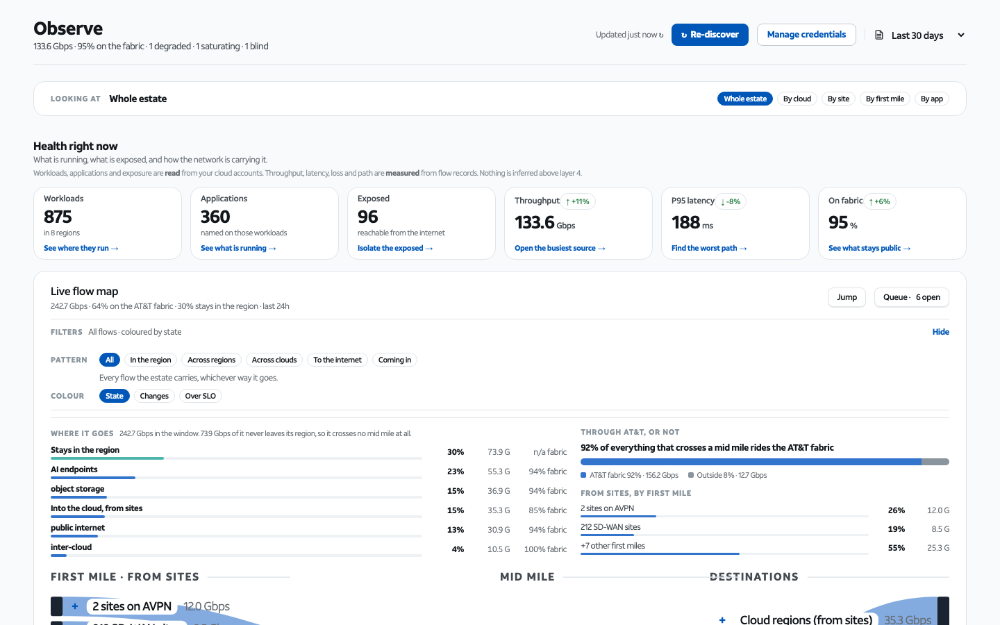

# Integrating this into your own application

Copyright (c) 2026 AT&T Intellectual Property. All rights reserved.

This prototype was built to be taken apart. Three ways in, cheapest first.

---

## 1. Drop the screens in, keep your own shell

The fastest path. The header and the left rail are the only chrome; the page
body is independent of both. A query parameter removes them at load:

| URL | Result |
|---|---|
| `NaaS Storefront.dc.html` | Full shell — top header, left rail |
| `NaaS Storefront.dc.html?chrome=norail` | Header only |
| `NaaS Storefront.dc.html?chrome=noheader` | Rail only |
| `NaaS Storefront.dc.html?chrome=off` | **Neither — page body alone** |

With `chrome=off` the content grid drops the rail track entirely and the body
runs to its own max width of 1392px, centred. No horizontal scroll, no gap
where the rail used to be.



Combine it with the screen hash to land straight on one screen:

```
NaaS Storefront.dc.html?chrome=off#s3/cloud/observe
```

| Hash | Screen |
|---|---|
| `#s3/cloud/connect` | Discover |
| `#s3/cloud/observe` | Observe |
| `#s3/cloud/govern` | Govern |
| `#s3/cloud/cost` | Cost |
| `#s1` | Explore 360 |

That is enough to iframe a screen into a host page, or to serve it behind
your own navigation, without editing a line of this code.

The switch is read in one place — `naas-app.js`, `const chrome = …` — and
exposed as `showHeader` and `showRail`. If you would rather force a mode than
pass a parameter, set those two constants and delete the parameter read.

---

## 2. Take the models, leave the markup

The interesting work is in the data layer, and it has no DOM in it. Every
module is a plain ES module of pure functions over the estate object. None of
them import React, none touch the document.

```js
import * as D  from './naas-data.js';        // the estate
import * as F  from './naas-flowmap.js';     // the sankey model
import * as C  from './naas-connections.js'; // connections, impact, records
import * as P  from './naas-paths.js';       // path pricing and comparison
import * as S  from './naas-sites.js';       // site classes, first-mile access
```

They return arrays and objects with numbers and labels already worked out —
node positions, ribbon thicknesses, prices, latencies, impact sets. You can
render them with anything.

`naas-logic.js` is the one worth reading first: `fmt` and `pct` for money and
percentages, `sankey()` for the flow-map solver, `heroLayout()` / `edgePath()`
/ `arcPath()` for the Discover picture. The sankey solver is self-contained
and has no AT&T-specific assumptions in it.

---

## 3. Point it at real data

`naas-data.js` and `naas-addendum.js` are the only sources of estate data.
Replace their exports with the same shapes fed from your API and the whole app
follows — every screen, every figure, every drill.

The shapes you need to satisfy:

```
regionsList[]   { cloud, region, priv, wl, tags[], fab, pub, ramp, acct, rel }
sites[]         { name, metro, access, priv, cls }
policies[]      { name, match, req, matched, viol, state }
inv[]           clouds → regions → vpcs → subnets → workloads → endpoints
```

`priv` is the single most load-bearing field in the app: it decides whether
something is on the AT&T fabric or on the public internet, and that decision
drives the colour of every wire, the price of every GB, and what appears under
"Off fabric" on Discover.

Two constraints to preserve if you wire this to production data:

- **Resolution.** Private destinations resolve to resource names; public ones
  stay as addresses. Do not resolve public destinations because you can — the
  screen's credibility rests on that line.
- **Layer 4.** Nothing above layer 4 is inferred. Application names come from
  cloud account tags that were read, never from packet inspection.

---

## What you can safely delete

| Path | Why you might not need it |
|---|---|
| `IA Map.dc.html` | Documentation page, not part of the app |
| `Elevator Boards.dc.html` | Documentation page; the elevator links to it |
| `docs/screenshots/` | Only used by these markdown files |
| `scripts/`, `.github/` | Only needed for GitHub Pages deploys |
| `brand/icons-linkdark/` | Only used when dark theme meets an active state |

Do not delete `support.js` — it is the template runtime, and every page is
inert without it.

---

## Things that will bite you

**`sc-for` inside `<table>` renders nothing.** The HTML parser hoists custom
elements out of table rows before the runtime sees them. Use the `.dt` family
of CSS-table classes. Every table in the app already does; copy one.

**Two separate value functions.** `naas-app.js` exports `vals()` and
`addendumVals()`. They are called separately and their scopes do not cross —
a helper defined in one is not visible in the other. If you add a value and
get "x is not defined", that is almost always why.

**Cache lifetime on static hosts.** ES modules are cached like any other
asset. If you deploy this behind a CDN, give the scripts a per-build URL, or
your users will run yesterday's JavaScript against today's markup.
`scripts/stamp-version.sh` shows one way to do it.

**Balanced tags.** The markup is one large file and the runtime is
unforgiving about structure. After editing it, count your tags:

```bash
python3 - <<'PY'
import re
s = open('NaaS Storefront.dc.html').read()
for t in ['div', 'sc-if', 'sc-for', 'button', 'span']:
    print(t, len(re.findall(r'<%s[\s>]' % t, s)), len(re.findall(r'</%s>' % t, s)))
PY
```

Every pair must match. A single stray `</div>` closes `<main>` early and takes
the rest of the page with it.

---

## Browser support

Chrome, Edge, Safari and Firefox, current versions. The app needs ES modules,
CSS custom properties, `grid`, and `ResizeObserver`. React 18 loads from a CDN
as UMD — if your environment blocks external CDNs, vendor `react` and
`react-dom` locally and update the two `<script>` tags at the top of the page.

No IE, no build-time transpilation, no polyfills shipped.
