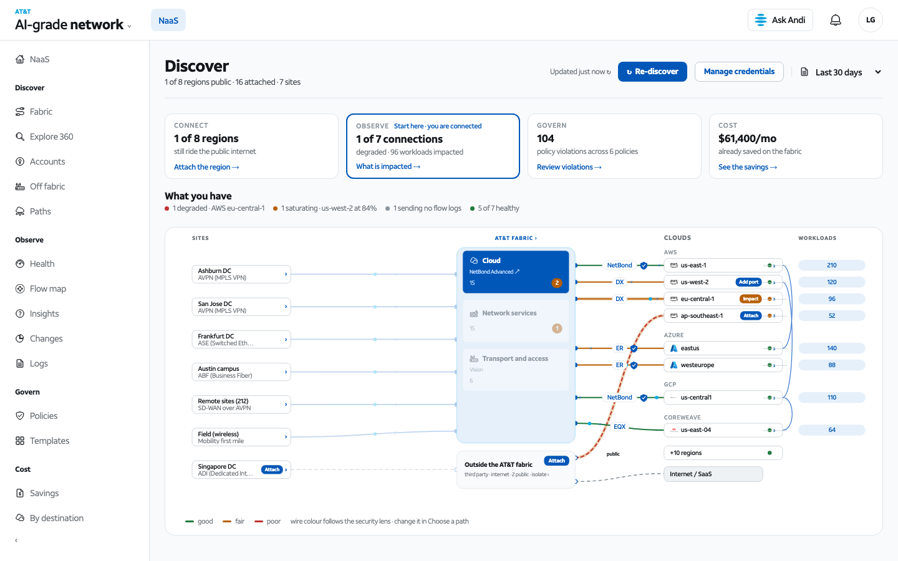
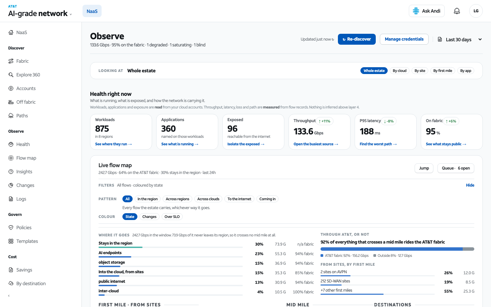
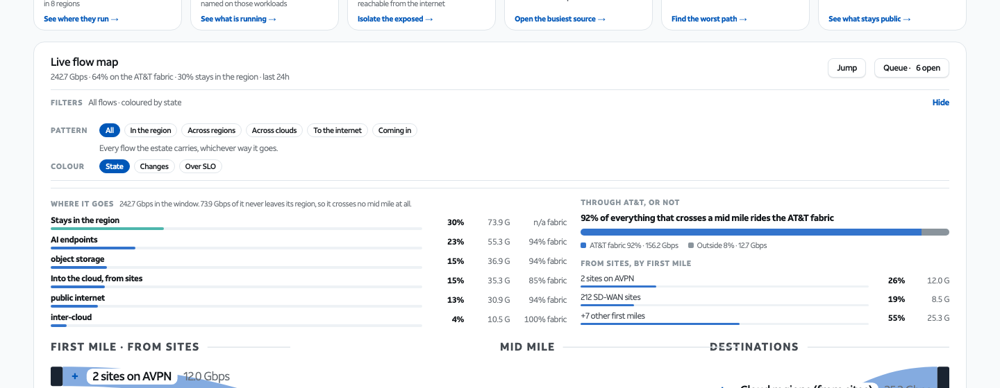
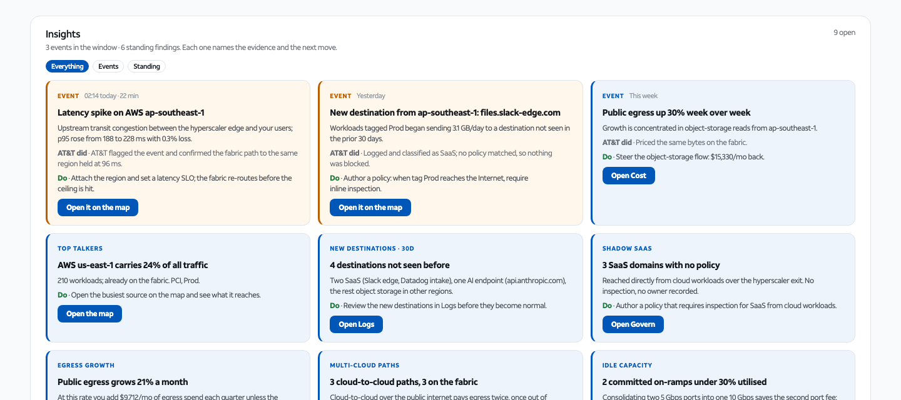
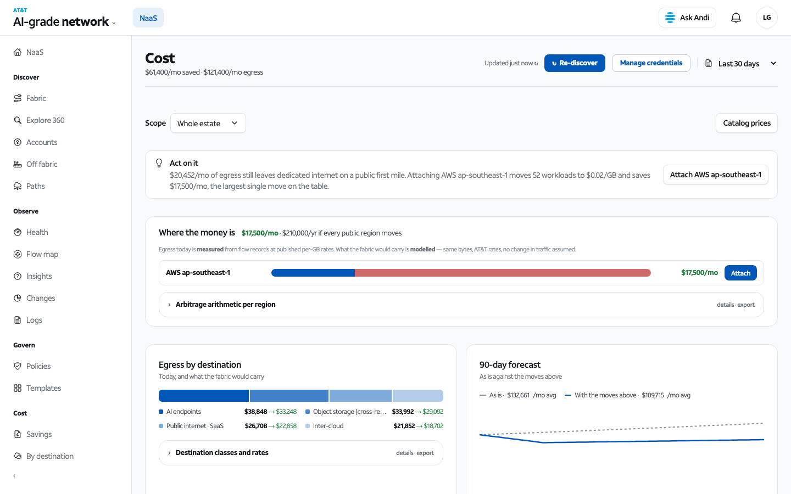

# AT&T AI-grade Network — NaaS storefront prototype

Copyright (c) 2026 AT&T Intellectual Property. All rights reserved.
AT&T proprietary and confidential. See `NOTICE`.

A working prototype of the NaaS storefront: five screens over one estate of
synthetic-but-consistent network data. No build step, no server-side code, no
package manager. Every file is served exactly as it sits on disk.

If you only want to lift screens or components into your own application,
read **[INTEGRATING.md](INTEGRATING.md)** — it is written for that job.

---

## Stand it up

Any static file server will do. It must be served over HTTP, not opened from
`file://`, because the app loads ES modules.

```bash
python3 -m http.server 8080
```

Then open <http://localhost:8080/> — `index.html` forwards to the storefront.

Node, if you prefer:

```bash
npx serve -l 8080 .
```

There is nothing to install and nothing to compile. If the page comes up
blank, look at the top left: the app prints its own render errors into a red
banner, so a broken binding is visible without opening a debugger.

---

## What you get



| Screen | What it answers |
|---|---|
| **Discover** | What is connected, where it came from, what is still off the fabric, and how to connect more |
| **Observe** | What the network is carrying right now, drilled from first mile to application |
| **Govern** | What policy is in force and what is violating it |
| **Cost** | What is being spent and what the fabric would save |
| **Explore 360** | The whole estate as a tree: cloud → region → VPC → subnet → workload |

Two supporting pages ship alongside: `IA Map.dc.html` (the information
architecture) and `Elevator Boards.dc.html` (the layer-elevator boards).

### Discover

The graph at the top is the answer to "what did you find with my
credentials". Under it, in the order a customer reads them: the accounts it
was drawn from, what is still on the public internet with the AT&T option and
tradeoff for each, and the ways to connect.

### Observe



The live flow map is the centre of the screen, in three columns: **first
mile → mid mile → destinations**. Traffic that starts and ends inside one
region crosses no mid mile, so it is drawn straight across under the band
rather than given a middle node that would misrepresent it as a path you
could buy.

Above it, a readout answers the two questions the picture alone does not:
where the traffic goes (share and Gbps per destination class, with the
fabric share of each) and how much of everything that crosses a mid mile
rides AT&T. The first-mile distribution from sites sits beside it.



Every node opens in place — site class → metro → site, and tag → region →
VPC → subnet → workload — and the tiles above re-count for whatever is
selected.

**Insights** sit under the map: events that happened, with a time and a
cause, and standing findings that are simply true. Each names its evidence,
what AT&T did about it, and one thing to do next.



**Logs** sit underneath in two tabs: flow records (what the network carried)
and user activity (who changed it, from where, and whether it applied).

### Cost



---

## Layout of the code

```
NaaS Storefront.dc.html   the app: markup, styles, the runtime, the React root
naas-app.js               the values layer — everything the markup binds to
naas-data.js              the estate: clouds, regions, sites, policies, products
naas-addendum.js          workloads, applications, endpoints
naas-logic.js             money, percentages, layout maths, the sankey solver
naas-flowmap.js           the live flow map model
naas-observe-dash.js      the Observe detail panels
naas-connections.js       connections, impact, flow records
naas-sites.js             site classes and first-mile access
naas-volume.js            the volume drawer (thousands of assets, sampled)
naas-round2.js            paths, lenses, scopes, anomalies
naas-paths.js             path pricing and comparison
naas-fabric.js            the fabric picture on Discover
support.js                the dc-runtime: template directives and bindings
brand/                    AT&T functional icons and marks
docs/screenshots/         the images in this README
scripts/stamp-version.sh  deploy-time build stamp and cache-busting
```

### How the templating works

The markup is plain HTML with three additions, resolved by `support.js`:

```html
<sc-if value="{{ someFlag }}" hint-placeholder-val="{{ true }}"> … </sc-if>
<sc-for list="{{ someRows }}" as="row" hint-placeholder-count="4"> … </sc-for>
<span>{{ row.label }}</span>
```

Bindings resolve against the object returned by `renderVals()` in
`NaaS Storefront.dc.html`, which spreads the values built in `naas-app.js`.
There is no framework of ours to learn: React 18 (UMD, from a CDN) renders,
and everything you touch is a plain object.

One trap worth knowing: **`sc-for` never renders inside a `<table>`.** The
browser's table parser hoists the custom element out of the row before the
runtime sees it. Use the `.dt` / `.dt-h` / `.dt-b` / `.dt-r` / `.dt-c`
CSS-table classes instead — every table in the app already does.

---

## Fonts

The design is set in **AT&T Aleck Sans**. The typeface is licensed and is
**not included in this package**. Every page declares it first and falls back
to `"Helvetica Neue", Helvetica, Arial, sans-serif`, so the app renders and
lays out correctly without it — the letterforms are simply not AT&T's.

To restore the intended type, drop the font files into `fonts/` beside the
HTML. The `@font-face` rules at the top of each page already point there:

```
fonts/ATTAleckSans_Regular.woff2
fonts/ATTAleckSans_Medium.woff2
fonts/ATTAleckSans_Bold.woff2
```

Get them from AT&T's brand asset library. Do not source them elsewhere.

---

## Deploying

`scripts/stamp-version.sh` builds a deployable copy into `_site`: it writes a
version footer from git metadata and rewrites every script reference to carry
`?v=<sha>`.

That cache-busting matters. GitHub Pages serves these files with
`cache-control: max-age=600`, so without a per-build URL a browser that opened
the site in the last ten minutes keeps running the previous build's JavaScript
against the new markup — and a fixed bug still looks broken to whoever you
sent the link to.

```bash
bash scripts/stamp-version.sh _site
```

The source tree is never modified, so a fresh design export drops in clean.

---

## Data

Every number on screen derives from one estate defined in `naas-data.js` and
`naas-addendum.js`. Nothing is hard-coded into the markup, and the figures are
internally consistent: workload counts roll up into region counts, egress
prices multiply out from the same GB-per-workload constant the flow map uses,
and the savings figure on Discover is the same arithmetic Cost shows.

The prototype holds one line strictly, and you should hold it too if you
extend the data: **private endpoints resolve to resource names, public
destinations stay unresolved, and nothing is inferred above layer 4.** A flow
record into a private VPC names the resource; one to the internet shows an IP.
That honesty is the point of the screen, not a limitation of it.
